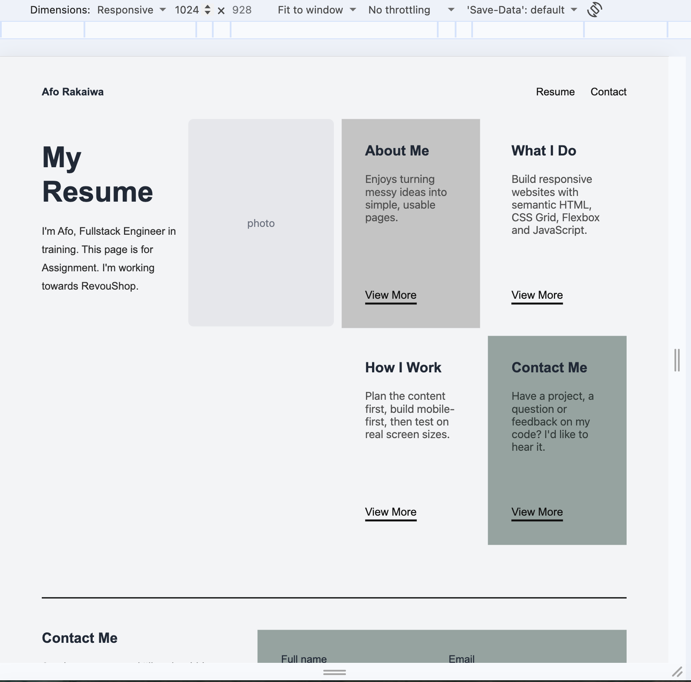
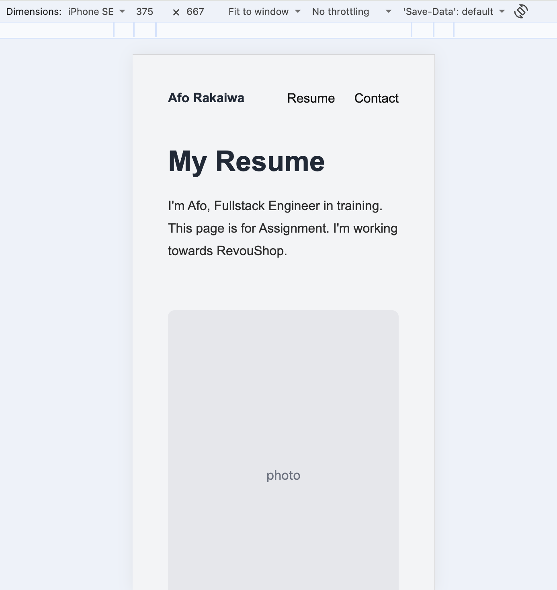
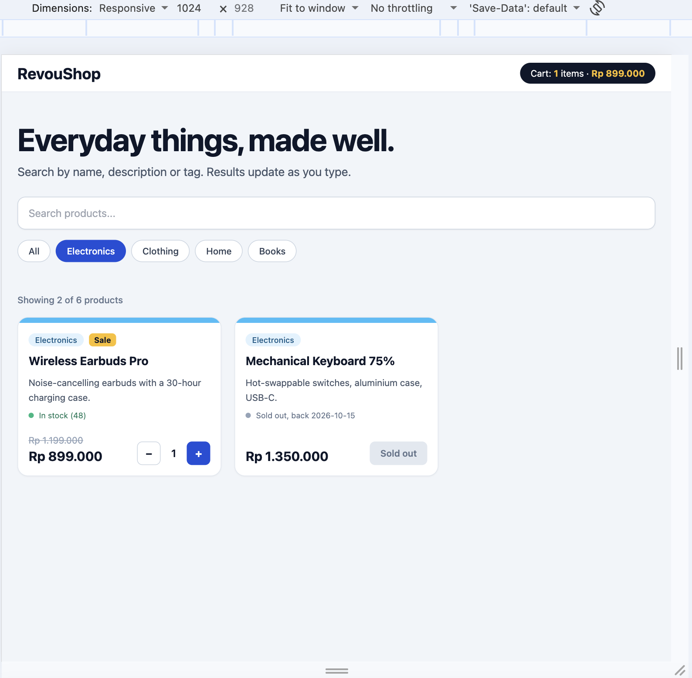
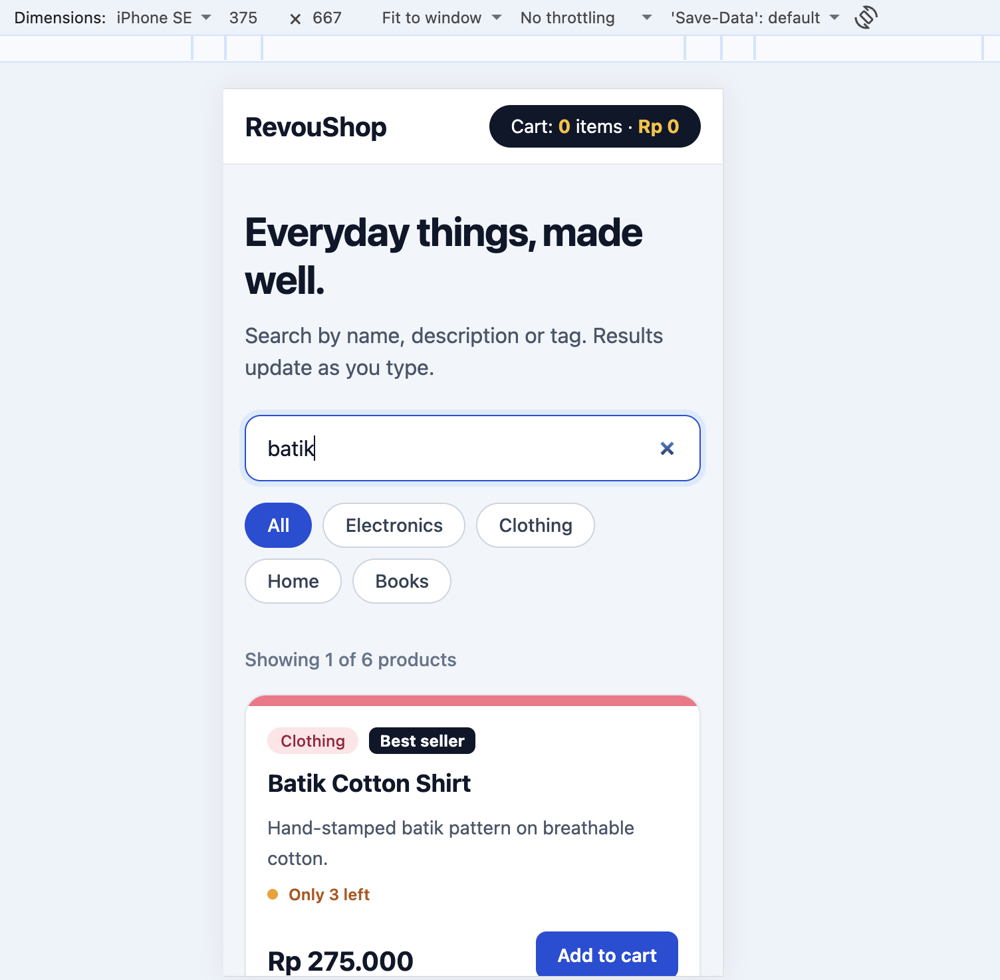

# Module 3 — RevoU FSSE

Assignment repository for **Afo Rakaiwa** (`module-3-aforakaiwa`).

This module covers HTML, CSS, JavaScript, TypeScript, and Tailwind CSS
fundamentals. It contains two self-contained parts, each in its own folder.

## What each folder contains

| Folder | Contents | Main tech |
| --- | --- | --- |
| [`profile-page/`](./profile-page) | A semantic profile / resume page with a contact form. Plain `index.html`, `styles.css`, and `script.js` — no build step. | HTML5, CSS Grid, vanilla JS |
| [`revoushopFE/`](./revoushopFE) | A typed, interactive product catalog. TypeScript source in `src/`, compiled output in `dist/`, and a Tailwind setup. Needs a build step. | TypeScript, Tailwind CSS |

### Repository structure

```
module-3-aforakaiwa/
├── README.md            # You are here
├── screenshot/          # Screenshots of both parts (desktop + mobile)
├── profile-page/        # Part 1 — HTML + CSS + JS profile page
│   ├── index.html       #   page markup
│   ├── styles.css       #   styling, grid layout, responsive breakpoints
│   └── script.js        #   View More toggles + contact form validation
└── revoushopFE/         # Part 2 — TypeScript + Tailwind product catalog
    ├── src/             #   source: types.ts, data.ts, styles.ts, main.ts, input.css
    ├── dist/            #   build output: main.js, output.css (generated)
    ├── index.html       #   loads dist/main.js and dist/output.css
    ├── package.json     #   dependencies and build scripts
    ├── tailwind.config.js
    └── tsconfig.json
```

## How to run / open each part locally

### Part 1 — Profile page (`profile-page/`)

No build or install needed. Just open the file:

- Double-click `profile-page/index.html`, or
- Right-click it in VS Code and choose **Open with Live Server** for auto-reload.

### Part 2 — Product catalog (`revoushopFE/`)

`index.html` loads the compiled files in `dist/`, so build first.

1. Move into the folder:
   ```bash
   cd revoushopFE
   ```
2. Install dependencies (first time only):
   ```bash
   npm install
   ```
3. Build the CSS and TypeScript:
   ```bash
   npm run build
   ```
4. Open `revoushopFE/index.html` in a browser (or use Live Server).

While developing, you can auto-rebuild on save by running these in two terminals:

```bash
npm run watch:css
npm run watch:ts
```

## Part summaries

**Part 1 — Profile page.** Semantic layout (`header`, `main`, `section`,
`article`, `figure`, `address`, `footer`), a contact form with typed inputs and
labels, CSS Grid layouts, mobile-first responsive breakpoints, plus "View More"
toggles and on-submit form validation.

**Part 2 — Product catalog.** Product data modeled with interfaces, type
aliases, and union types; live search across name, description, and tags;
category filters; and a cart with add/remove controls and a Rupiah total.
Rendering is driven by `map` / `filter` / `reduce` over typed arrays. See
[`revoushopFE/README.md`](./revoushopFE/README.md) for more detail.

## Screenshots

### Part 1 — Profile page

**Desktop**



**Mobile**



### Part 2 — Product catalog (live search + Tailwind styling)

**Desktop**



**Mobile**



## Author

Afo Rakaiwa — RevoU Full Stack Software Engineering.
